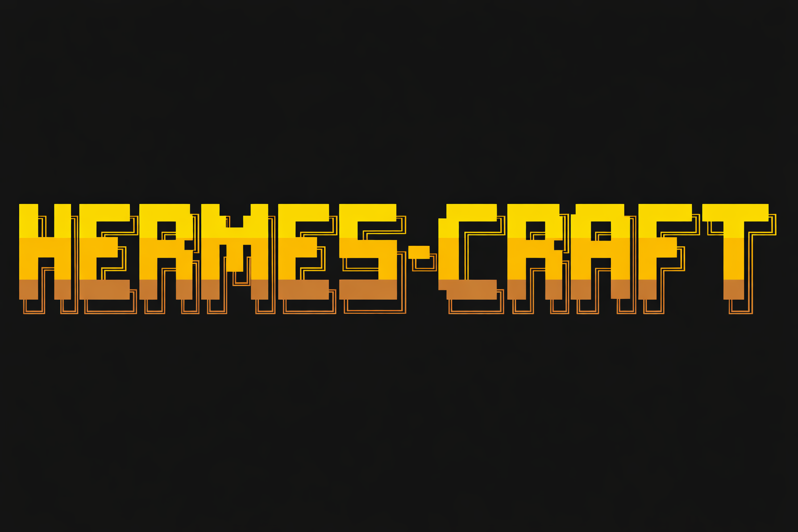

<p align="center">
  
</p>

# HermesCraft

An autonomous AI agent that plays Minecraft survival mode, powered by [Nous Hermes](https://nousresearch.com/) running locally via vLLM. The agent controls a real Minecraft client through a custom Fabric mod, working through 7 phases to defeat the Ender Dragon — all without human input.

## How It Works

Every 3 seconds, the agent runs an **observe-think-act** loop:

1. **Observe** — Fetch game state from the HermesBridge mod (position, health, inventory, nearby blocks/entities)
2. **Think** — Send observation + phase goals to Hermes via vLLM. The model reasons and picks an action via native tool calling.
3. **Act** — Execute the action through the mod API (mine, craft, move, attack, place, etc.)

The agent maintains conversation history for context, learns from deaths, and automatically advances through 7 phases from punching trees to killing the Ender Dragon.

## Prerequisites

- **GPU**: 8GB+ VRAM (8B model) or 32GB+ (14B model)
- **Minecraft**: Java Edition 1.21.1 client with Fabric loader + Baritone
- **Node.js**: 20+
- **Python**: 3.10+ with vLLM installed

## Quick Start

```bash
# 1. Clone and install
git clone https://github.com/hermescraft/hermescraft.git
cd hermescraft
npm install

# 2. Build the HermesBridge mod (Fabric 1.21.1)
cd mod && ./gradlew build
cp build/libs/hermesbridge-*.jar ~/.minecraft/mods/
cd ..

# 3. Start vLLM with Hermes (in a separate terminal)
./vllm.sh

# 4. Launch Minecraft client, connect to a 1.21.1 survival server

# 5. Start the agent
./start.sh
```

## Configuration

Copy `.env.example` to `.env` and edit as needed:

```bash
VLLM_URL=http://localhost:8000/v1
MODEL_NAME=NousResearch/Hermes-4-14B    # or any Hermes model
MOD_URL=http://localhost:3001
TICK_MS=3000
```

Any [NousResearch Hermes](https://huggingface.co/collections/NousResearch/hermes-4-collection-68a731bfd452e20816725728) model works — just set `MODEL_NAME` and adjust vLLM flags accordingly.

## Components

### Agent (`agent/`)

The brain. 10 JS modules handling the observe-think-act loop, LLM communication (native Hermes tool calling with text-parsing fallback), multi-level memory (session conversation, curated lessons, session transcripts, learned skills), 7-phase goal progression, and stuck/death recovery.

### HermesBridge Mod (`mod/`)

A Fabric 1.21.1 mod that exposes game state and accepts commands over HTTP (port 3001).

| Endpoint | Description |
|----------|-------------|
| `GET /health` | Mod status |
| `GET /state` | Full game state (position, health, inventory, nearby blocks/entities) |
| `POST /action` | Execute a game action (move, mine, place, craft, attack, use, look) |
| `GET /recipes?item=X` | Recipe lookup |

Integrates with Baritone for pathfinding — the agent issues high-level commands and Baritone handles navigation.

## The 7 Phases

| # | Phase | Key Objectives |
|---|-------|---------------|
| 1 | First Night | Shelter, wooden tools, furnace, food |
| 2 | Iron Age | 20+ iron, full iron gear, shield, base |
| 3 | Diamonds | Mine to Y=-59, 11+ diamonds, diamond gear |
| 4 | Nether | Obsidian, build portal, enter Nether |
| 5 | Blaze Rods | Find fortress, kill blazes, 7+ rods |
| 6 | Ender Pearls | Hunt endermen, 12+ pearls, craft Eyes of Ender |
| 7 | Dragon Fight | Find stronghold, enter End, kill the dragon |

## Project Structure

```
hermescraft/
  agent/          # Node.js agent (observe-think-act loop)
  mod/            # HermesBridge Fabric mod (Java)
  config/         # Agent personality and goal config
  vllm.sh         # vLLM launcher (auto-restart)
  start.sh        # Agent launcher (preflight checks + auto-restart)
  .env.example    # Environment variables template
```

## License

MIT
